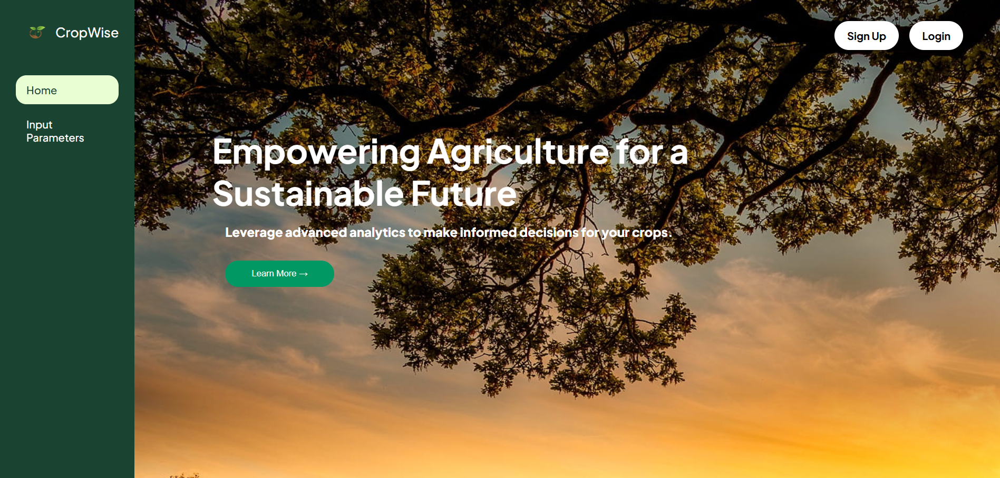

## 🌾 Crop Recommendation System

### 📌 Project Description

This project implements a machine learning-based **Crop Recommendation System** that suggests the best crops to grow based on seven key soil and environmental parameters:
- Nitrogen (N)
- Phosphorus (P)
- Potassium (K)
- Moisture
- Temperature
- pH
- Rainfall

We trained and tested the system using a dataset containing **22 different crops**, applying various machine learning models including:
- XGBoost
- Decision Tree
- Random Forest
- Support Vector Machine (SVM)
- Naive Bayes
- Logistic Regression

### 🌐 Website Features

The web interface includes:
- **User Authentication Page** – Secure login and registration
- **Landing Page** – Introduction and navigation
- **Input Form** – Users provide soil and environmental values
- **Recommendation Page** – Displays the **top 3 crops** suitable for the given inputs

Additionally, the site integrates a **Weather API** to display:
- Weather data for the **past 5 days**
- Other relevant crop and climate insights

---

### 🛠️ Tech Stack

- **Backend:** Python Flask  
- **Frontend:** HTML/CSS, JavaScript  
- **Machine Learning Models:** scikit-learn, XGBoost, Decision Tree, Random Forest  
- **API Integration:** Weather API

---

### 🖼️ Website Screenshots

<table>
  <tr>
    <td align="center">
       
      <b>Home Page</b>
    </td>
    <td align="center">
       
      <b>Input Parameters</b>
    </td>
    <td align="center">
       
      <b>Crop Recommendation</b>
    </td>
  </tr>
  <tr>
    <td align="center">
       
      <b>Dashboard</b>
    </td>
    <td align="center">
       
      <b>Model Accuracy</b>
    </td>
  </tr>
</table>

---

